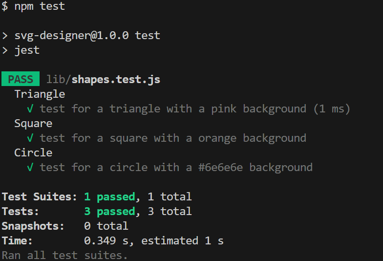

# SVG Logo Generator
## Description

SVG Designer is a command line interface app that allows users to create a simple 300x200 logo design in the form of an SVG file consisting of three characters in the middle of a basic shape. The shapes can be a Triangle, Circle, or Square and the color of the shape and the text within can be any color that the user chooses.

## Table of Contents

- [Technology](#Technology)
- [Installation](#installation)
- [Usage](#usage)
- [Test](#test)
- [Credits](#credits)
- [License](#license)

## Technology

- JavaScript
- Node.js
- Inquirer
- Jest

## Installation

Click on the repository link below to download the CLI app. Once there, download the zip file and copy into a directory or clone the repository into a directory using your terminal. Then, go to the directory where the CLI is kept and open in VS Code. Open the terminal in VS Code and make sure to download the requried packages by running `npm i` in the terminal.

https://github.com/CullenKnott/svg-designer

## Usage

In the terminal, run the command `node index.js` and the inquirer package will begin to prompt you for information for the .SVG logo. Go through each prompt and answer them with the appropriate information. Once all the prompts are completed, then the information that was given by the user will then be used to create the custom logo and the .SVG file will then be generated.

Here is a video walkthrough on how to use the application

https://youtu.be/0uT42Q8q0pQ

## Test

To test this app, open up the file in VS Code. Open the terminal, change directory into the root folder `svg-desinger`, and run `npm test`. This will ensure that the code is functioning appropriately.

## License

MIT License

Copyright (c) [2023] [CullenKnott]

Permission is hereby granted, free of charge, to any person obtaining a copy of this software and associated documentation files (the "Software"), to deal in the Software without restriction, including without limitation the rights to use, copy, modify, merge, publish, distribute, sublicense, and/or sell copies of the Software, and to permit persons to whom the Software is furnished to do so, subject to the following conditions:

The above copyright notice and this permission notice shall be included in all copies or substantial portions of the Software.
